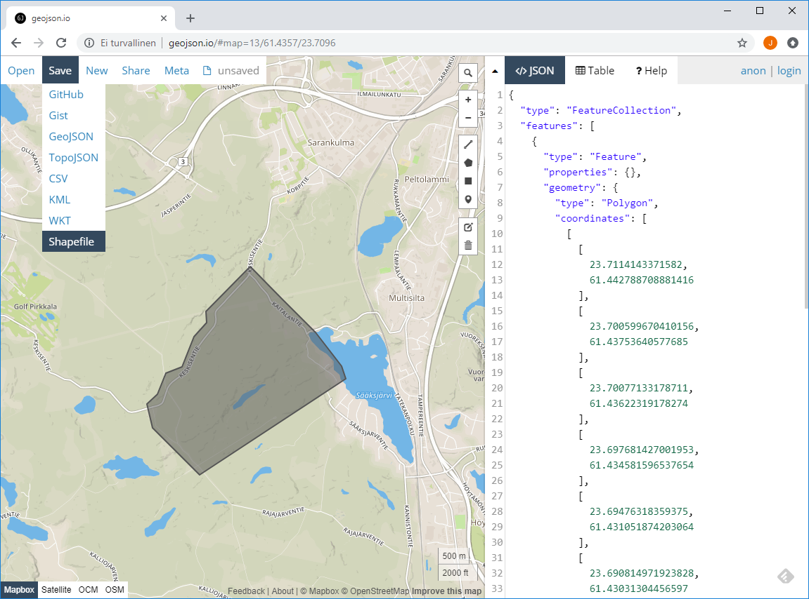
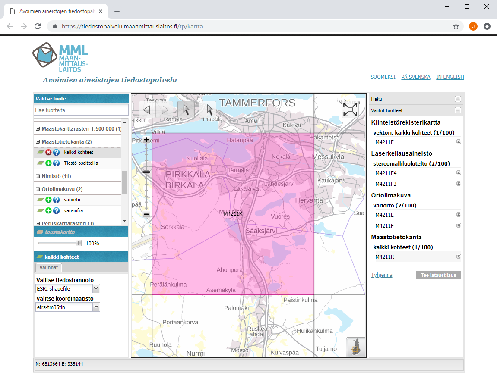
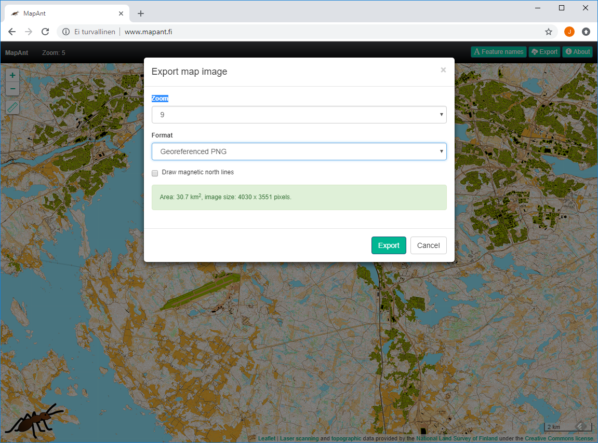
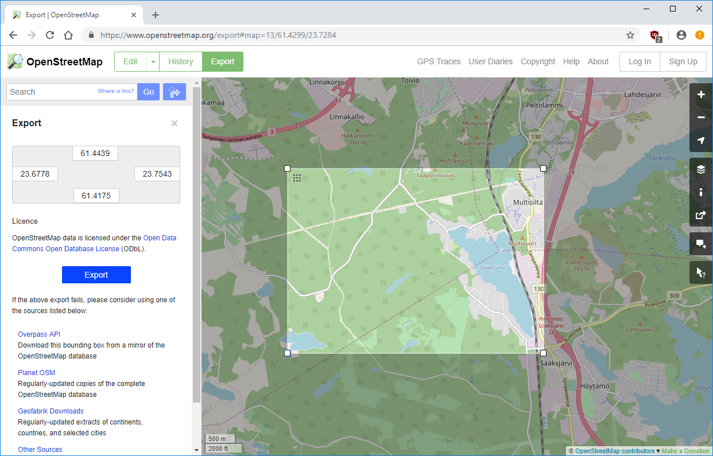
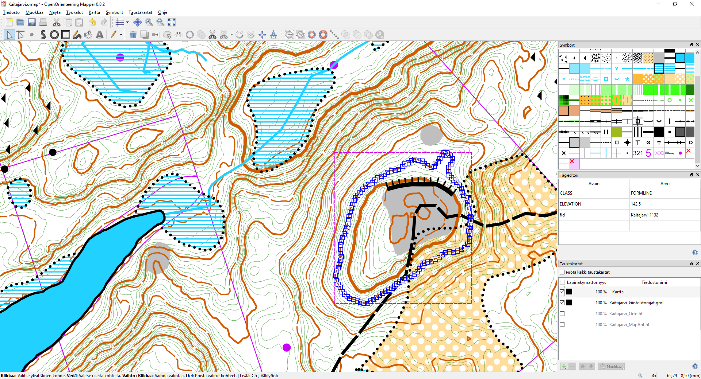

# Suunnistuskartan pohja-aineiston valmistelu avoimista aineistoista OOM:lle

## Ohjelmat

Kaikki käytetyt ohjelmat ovat ilmaisia. Käyttöympäristönä on Windows.

* [OpenOrienteering Mapper](https://www.openorienteering.org/), eli kotoisasti "OOM"
* [OSGeo4W](https://trac.osgeo.org/osgeo4w/) on Windows -ympäristöön koottu ohjelmistokokonaisuus kartta-aineiston käsittelyyn
* [LASTools](https://rapidlasso.com/)
  
Lisäksi tarvitset:
* MML:n MTK --> ISOM2017 -translaatiotaulukon [MTK-ISOM2017.crt](https://github.com/jjojala/mapping/raw/master/MTK-ISOM2017.crt)
* LASTools:n jäljiltä käyrät sisältävän Shapefile:n rikastamiseen ja käyrien luokitteluun tarkoitetun skriptinpätkän
([contours.py](https://github.com/jjojala/mapping/raw/master/contours.py))

Sen sijaan **et** tarvitse ([koska...](Miksi_ei.md)):
* OCAD:ia, tai
* Pullautinta

## Alueen rajaus

Aloitetaan alueen rajaamisella. Se onnistuu esimerkiksi [geojson.net](https://geojson.net/) -palvelussa. Käyttääksesi palvelua
et tarvitse käyttäjätunnusta.

Valitse karttanäkymän oikeasta laidasta *Draw a polygon* -työkalu ja rajaa sillä kartoitettava alue. Tallenna alue
*Shapefile* -muodossa valikon *Save->Shapefile* -toiminnolla.



Pura ladattu tiedosto esimerkiksi tekemääsi hakemistoon `geojson.net`.

Käynnistä OSGeo4W Shell (komentotulkki) esimerkiksi Windows:n *Start* -valikon kautta ja muuta aluerajaus MML:n käyttämään koordinaatistoon:

```
> ogr2ogr -t_srs EPSG:3067 rajaus.shp geojson.net\layers\POLYGON.shp
```

Älä sulje *OSGeo4W shell*:iä komennon jälkeen (myöhemmin tässä ohjeessa suoritettavat komennot ajetaan
samasta ikkunasta).

## Aineistot

Tarvittavat avoimet aineistot saadaan seuraavista palveluista:
* [Maanmittauslaitoksen (MML) avoimien aineistojen tiedostopalvelu](https://tiedostopalvelu.maanmittauslaitos.fi/tp/kartta)
* [MapAnt](https://mapant.fi/)
* [OpenStreetMap](https://www.openstreetmap.org/)

### Maanmittauslaitoksen (MML) avoimet aineistot

Lataa MML:n avoimet aineistot palvelusta:
  https://tiedostopalvelu.maanmittauslaitos.fi/tp/kartta

Valitse vasemmassa reunassa noudettavan materiaalin tyyppi yksi kerraallaan ja klikkaa sen jälkeen haluamaasi aluetta.
Lista noudettavasta materiaalista muodostuu oikeaan reunaan. Noudettavia materiaaleja ovat:
* JPEG2000 -muotoiset ortoilmakuvat
* laserkeilaus-, eli pistepilviaineisto (mielellään stereomalliluokiteltu)
* Maastotietokanta, kaikki kohteet
* kiinteistörekisterikartta, vektori, kaikki kohteet



Tee lataustilaus ja odota, että saat sähköpostiisi latauslinkin. Lataa aineistot ja kopioi ne esimerkiksi tekemääsi
hakemistoon `MML`. Pura zip -paketit vastaavan nimiseen hakemistoon, esim. `MML\M4211R.shp.zip` --> `MML\M4211R.shp`

### MapAnt

Hae MapAnt -kartta palvelusta https://www.mapant.fi/. Tuonti käynnistetään *Export* -toiminnolla, jonka jälkeen
hiirellä rajataan kartalta noudettava suorakaiteenmuotoinen alue. Käytä tuonnissa tarkinta lähennystasoa (Zoom=9)
ja muotona georeferoitua PNG:tä (Format="Georeferenced PNG"):



Pura ladattu zip-tiedosto esimerkiksi tekemääsi hakemistoon `MapAnt`.

### OpenStreetMap (OSM)

OSM -palvelu löytyy osoitteesta https://openstreetmap.org/. Aineiston voi rajata ja tuoda karttanäkymästä *Export* -toiminnolla.
Kopioi ladattu `map.osm` hakemistoon `OSM`.



## Aineiston valmistelu

### MapAnt -kartan valmistelu

Rajataan kartoitettava alue:

```
> gdalwarp -cutline rajaus.shp -crop_to_cutline -dstalpha -s_srs EPSG:3067 ^
            -co COMPRESS=JPEG -co WORLDFILE=YES MapAnt\MapAnt.png Kaitajarvi_MapAnt.tif
```

Tässä vaiheessa on luontevaa luoda OOM -kartta ja tuoda sinne edellä synnytetty `Kaitajarvi_MapAnt.tif` taustakartaksi
georeferointeineen ja karttapohjoisen asetuksineen (kts. pikakartan valmistusohjetta).

### Ortoilmakuvien valmistelu

Yhdistetään kuvat (jos useita):

```
> gdalwarp MML\M4211E.jp2 MML\M4211F.jp2 MML\M4211E+F.tif
```

... ja rajataan kartoitettavaan alueeseen (kuten MapAnt -kartta):

```
> gdalwarp -cutline rajaus.shp -crop_to_cutline -dstalpha -s_srs EPSG:3067 ^
            -co COMPRESS=JPEG -co WORLDFILE=YES MML\M4211E+f.tif Kaitajarvi_Orto.tif
```

Tässä vaiheessa on jälleen hyvä avata syntynyt `Kaitajarvi_Orto.tif` luotavan kartan taustakartaksi.

### Kiinteistörajojen valmistelu ja tuonti

Rajataan kiinteistötiedot:

```
> ogr2ogr -clipsrc rajaus.shp Kaitajarvi_kiinteistorajat.gml MML\M4211E\M4211E_kiinteistoraja.shp
```

Lopputuloksena syntyvä `Kaitajarvi_kiinteistorajat.gml` voidaan tuoda _taustakarttana_ OMAP-karttaan.

### OpenStreetMap -kartan valmistelu ja tuonti

OSM -kartta ei käytä MML:n käyttämää koordinaattijärjestelmää, joten se pitää ensin muuttaa:

```
> ogr2ogr -t_srs EPSG:3067 OSM\map.gml OSM\map.osm
```

Muutoksen jälkseen rajataan materiaali kartoitettavaan alueeseen:

```
> ogr2ogr -clipsrc rajaus.shp Kaitajarvi_osm.gml OSM\map.gml
```

Lopputuloksenä syntyvä `Kaitajarvi_osm.gml` on yleensä mielekästä avata taustakarttana. Tällöin taustakartan
avaulla piirretään taustakartan halutut kohteet myös OOM-karttaan.

Jos OSM-kartta sisältää huomattavan paljon kartalle sellaisenaan tuotavia kohteita (esimerkiksi polkuja), voi olla
mielekästä tuoda OSM-kartta OOM-karttaan sellaisenaan. Tuotuun karttaan sovelletaan sellaisenaan `OSM-ISOM2017.crt`
-translaaatiotaulua.

### Maastotietokannan valmistelu ja tuonti

Useista Shapefileistä koostuva maastotietokanta (purettu zip:stä) yhdistetään yhdeski GML-tiedostoksi:

```
> ogrmerge -o MML\M4211R.gml MML\M4211R.shp\*.shp
```

... ja rajataan:

```
> ogr2ogr -clipsrc rajaus.shp Kaitajarvi_mtk.gml MML\M4211R.gml
```

Lopputuloksena syntyvä `Kaitajarvi_mtk.gml` tuodaan OOM -karttaan. Maastotietokannan symbolit muutetaan OMAP -symboleiksi
lataamalla `MTK-ISOM2017.crt` -tiedosto. Hyödyttömiä symboleita voi tässä vaiheessa poistaa tai piilottaa.

### Laserpistepilven valmistelu ja tuonti

Jos pistepilvitiedostoja on useita, yhdistellään ne ja poistetaan samalla muut, kuin 
maanpintaa kuvaavat "ground"/class 2 -pisteet (pistepilvessä on myös esim. kasvillisuutta kuvaavia pisteitä):

```
> las2las.exe -i MML\M4211E4.laz MML\M4211F3.laz -merged -keep_class 2 -o MML\M4211E4+F3_ground.laz
```

... rajataan materiaali vain tarvittavaan alueeseen:

```
> lasclip.exe -i MML\M4211E4+F3_ground.laz -o MML\Kaitajarvi_ground.laz -poly rajaus.shp -v
```

... pelkistetään pistepilveä:

```
> lasthin.exe -i MML\Kaitajarvi_ground.laz -o MML\Kaitajarvi_ground_thinned.laz
```

... ja muutetaan lopputulos käyräviivaksi (puolen metrin käyrävälein):

```
> las2iso.exe -i MML\Kaitajarvi_ground_thinned.laz -o MML\Kaitajarvi_contours05.shp ^
               -iso_every 0.5 -clean 8 -simplify 4 -smooth 5
```

Seuraavaksi onkin päätettävä kartassa käytettävä käyräväli ja johtokäyrien tasot. Komennolla:

```
> python contours.py -info MML\Kaitajarvi_contours05.shp
```

... saat yhteenvedon korkeusvaihtelusta ja taulukon, jossa on kuvattu miten monta käyräsymbolia milläkin korkeustasolla esiintyy:

```
Elevation range: 107.50 - 155.00m:
        Elevation | count
        -----------------------
        107.50m   |    3
        108.75m   |    2
        ...
        ...
        150.00m   |   17
        151.25m   |   21
        152.50m   |    9
        153.75m   |    4
        155.00m   |    1
```

Esimerkiksi tässä tapauksessa alueen korkeus vaihtelee välillä 107,5 - 155m ja on siis 47,5m. Jos (ja kun) käyräväliksi
valitaan viisi metriä, johtokäyrätasoja mahtuu vaihteluvälille kaksi (koska joka viides korkeuskäyrä on johtokäyrä), 
ylemmän ollessa esimerkiksi tasolla 145m. ISOM 2017 suosittelee johtokäyrätason valinnaksi "*merkittävimpien rinteiden
keskitason*".

Nyt, kun tiedetään käyräväli (5m) ja vähintään yksi käytetettävä johtokäyrän korkeustaso (145m), voidaan tehdä käyrien luokittelu:

```
> python contours.py -tag 145 5 MML\Kaitajarvi_contours05.shp Kaitajarvi_contours05.gml
```

Lopputulos `Kaitajarvi_contours05.gml` voidaan lisätä OOM -karttaan "Tuo" -toiminnolla. Tuodut käyräsymbolit muutetaan
OMAP -symboleiksi lataamalla `MTK-ISOM2017.crt` -tiedosto. Lopullisesta kartasta pois jäävät kartoituksen avuksi tarkoitetut
tukikäyrät esitetään purppuralla oletussymbolilla, mutta niitä varten kannattaa käsin tehdä esim. 0,03mm leveä tumman vihreä
käyräsymboli. Kokonaan niitä ei kannata poistaa, sillä tukikäyrät ovat mm. maastossa hyvin tarpeellisia.



... ja koko kartta edellä kuvattujen mekaanisten vaiheiden jäljiltä:
[Kaitajarvi](https://github.com/jjojala/mapping/raw/master/images/Kaitajarvi_raw.pdf)

## Entä sitten?

Ennen maastoon ryntäämistä voi, ja kannattaa pohja-aineiston kanssa vähän jumpata, esimerkiksi:

* OSM -pohjista kannattaa tarkistaa mahdollisia kartalle kuvattavia kohteita. OSM-pohjissa on erityisesti taajamien liepeillä
  MTK:ta kattavampaa tietoa esimerkiksi poluista.
* Ortoilmakuvia kannattaa verrata kiinteistörajoihin. Jos ilmakuvasta näkyy hakkuu, joka näyttäisi rajautuvan kiinteistörajaan,
  kyseessä on melkoisella varmuudella myös maastossa selvästi erottuva kuvioraja. Ilmakuvista voi näkyä myös muita
  MTK-materiaalista puuttuvia kohteita.
* Myös MapAnt -karttaa kannattaa verrata kiinteistörajoihin. Jos MapAnt -kartassa aukko tai tiheikkö rajautuu kiinteistörajaan,
  kyseessä todennäköisesti on maastossa selvästi erottuva kuvioraja - erityisesti jos sama raja erottuuT vielä ortoilmakuvassakin.
* Taajama- ja esimerkiksi mökkialueilla kiinteistörajojen perusteella voi kuvata tonttivihreät. Tässä on tosin huomattava, että
  isoilla, metsäisillä tonteilla koko tontti ei ole välttämättä kiellettyä aluetta.
* Korkeuskäyriä voi trimmailla melkein loputtomiin. Useimmat laserpohjista otetut käyrän mutkat eivät erotu maastossa, joten
  yleensä on aika turvallista pelkistää ja suoristaa käyräviivoja jo ennen maastotyötä - tosin maastossa käynnin jälkeen
  voi tulla yllätyksiäkin ja joskus jonkun muodon korostaminen maastokäynnin jälkeen tuntuu ilmeiseltä.

On myös muita avoimia materiaaleja:
* Esimerkiksi [Bing Aerial](https://www.bing.com/maps/aerial), [Google Maps](https://www.google.com/maps/) -ilmakuvista
  voi toisinaan näkyä jotakin sellaista, joka ei MML:n ortoilmakuvista irtoa. Kaikista palveluista kuvia ei saa georeferoituna,
  joten kohteiden todellisen sijainnin kanssa kannattaa olla tarkkana. Toisinaan kuvat voivat olla myös huomattavan vanhoja.
  Myös esimerkiksi kunnilta saattaa saada alueesta ilmakuvia.
* [Google Street View:n](https://mapstreetview.com/) avulla voit tsekkailla tien reunat
  ([esimerkki](https://github.com/jjojala/mapping/raw/master/images/GoogleStreetView.png)
  ja sama [livenä](https://mapstreetview.com/#10ksus_e4fmr_3n.a_0g42))
* Kuntien kaavakartat.
* [Vanhat painetut kartat](http://vanhatpainetutkartat.maanmittauslaitos.fi/) -palvelusta kannattaa kaivaa vanhoja karttoja.
  Vanhat kartat eivät ole georeferoituja ja niissä on (ennen vuotta 2003) myös eri projektio. Tästä syystä ne kannattaa
  asemoida aina kulloinkin käsiteltävän alueen perusteella paikalleen ennen käyttöä. Kun asemoinnin tekee huolella,
  vanhoista kartoista irtoaa yllättävän hyvää tietoa. Esimerkiksi nykyisin maastossa kuviorajoina erottuvat jo vuosia sitten
  paketoitujen peltojen reunat saa kätevästi poimittua vanhoista kartoista.
* [Strava Global Heatmap](https://www.strava.com/heatmap) -palvelusta voi nähdä Strava -käyttäjien yleisimmin käyttämiä
  GPS-jälkiä. Jäljistä on mahdollista piirtää esimerkiksi yleisesti käytetyt ulkoilureitit.
* Aiemmat suunnistuskartat, luonnollisesti.

Työpöydän ääressä valmisteltu kartta voi näyttää esimerkiksi 
[tältä](https://github.com/jjojala/mapping/raw/master/images/Kaitajarvi.pdf). 
Sitten vaan maastoon tarkistamaan pohjatyön tulosta, korjaamaan ja täydentämään...

(Vertailun vuoksi kartta vuodelta 1993 löytyy [täältä](https://github.com/jjojala/mapping/raw/master/images/Kaitajarvi_1993.png),
Copyright 1993 (C) Tampereen Yritys).
